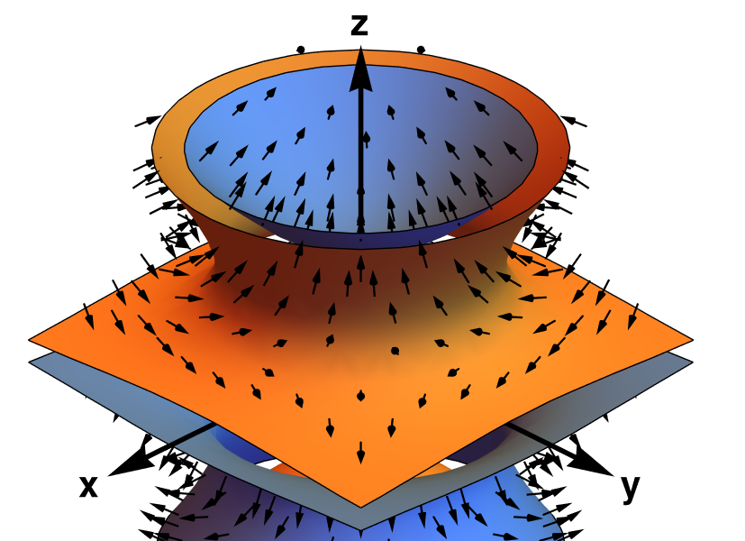

sphericart documentation
========================

   A plot of the :math:`\pm1` isosurfaces of the :math:`Y^0_3` solid harmonic, including its gradient

``sphericart`` is a multi-language library for the efficient calculation of 
spherical harmonics and their derivatives in Cartesian coordinates. 

The theory behind this efficient implementation is detailed in this 
`paper <https://arxiv.org/abs/2302.08381>`_. 

The core library is implemented in C++ (with OpenMP parallelism) and CUDA.
It provides APIs for C, Python (NumPy), PyTorch and JAX. The torch and JAX
implementations provide fast spherical harmonics evaluations on GPUs.

A native Julia package is also available.

This documentation contains an installation guide, an API overview, some examples
of how to use the library, and a brief explanation of the mathematics involved.

.. toctree::
    :maxdepth: 1

    installation
    api
    examples
    maths

If you are using sphericart for your academic work, you can cite it as

.. code-block::

    @article{sphericart,
        title={Fast evaluation of spherical harmonics with sphericart},
        author={Bigi, Filippo and Fraux, Guillaume and Browning, Nicholas J. and Ceriotti, Michele},
        journal={J. Chem. Phys.},
        year={2023},
        number={159},
        pages={064802},
    }
