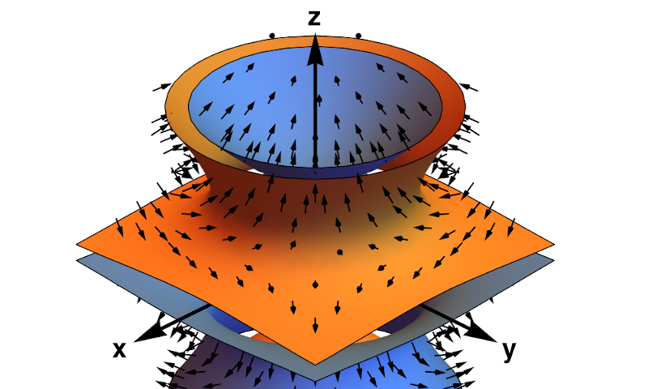

sphericart documentation
========================

``sphericart`` is a multi-language library for the efficient calculation of 
spherical harmonics and their derivatives in Cartesian coordinates. 

The theory behind this efficient implementation is detailed in this 
`paper <https://arxiv.org/abs/2302.08381>`_. 

The core library is implemented in C++, and provides APIs for C, Python and
Pytorch, with OpenMPI parallelism. In addition, the PyTorch-based implementation 
provides fast spherical harmonics evaluation on GPUs using CUDA.

This documentation contains two quick guides on how to install and use
the library, as well as a more comprehensive overview of the different APIs.

.. toctree::
    :maxdepth: 1

    installation
    api
    using
    maths

   A plot of the +-1 isosurfaces of the :math:`Y^0_3` solid harmonic, including also gradients

